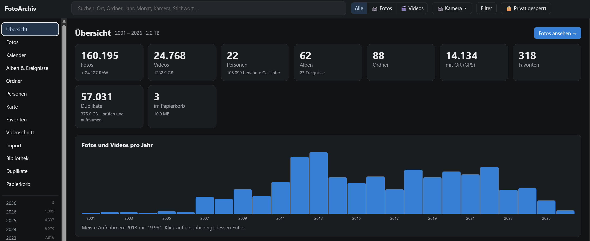
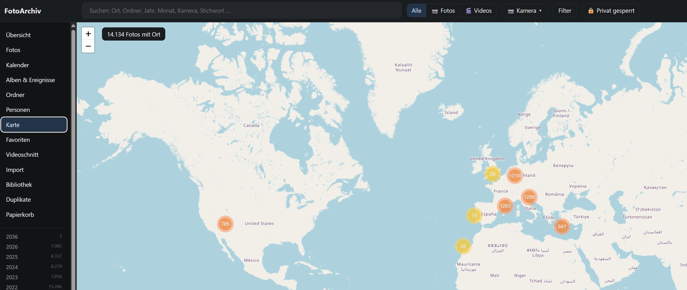
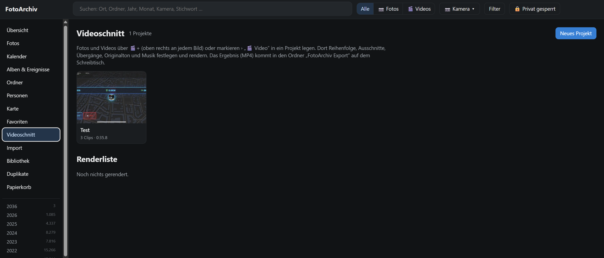
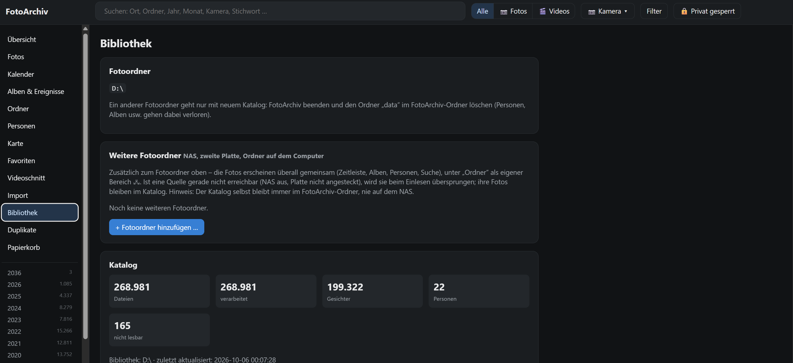

# FotoArchiv

Fotoverwaltung im Browser – ohne Cloud, ohne Abo, ohne Installation. Läuft unter Windows und macOS
direkt aus einem Ordner (auch von einer externen Festplatte) und lässt die Fotos, wo sie sind.

- Zeitleiste, Kalender, Ordner, Karte, Favoriten, Volltextsuche (Ort, Monat, Kamera, Stichwort …)
- Filter nach Fotos/Videos und **Kamera** (z. B. alle GoPro-Aufnahmen), auch innerhalb von Alben, Jahren, Ordnern
- Mehrere Fotoordner: externe Platten, **NAS**, lokale Ordner – gemeinsam durchsuchbar
- **Fotobearbeitung** (zuschneiden, begradigen, Licht, Farbe, Tiefen/Lichter – Original bleibt unverändert)
- **Videoschnitt** mit Zeitleiste, Übergängen, Originalton und Musik; Rendern auf allen Prozessorkernen
- **Gesichtserkennung** auf dem eigenen Computer: Gesichter werden gruppiert, einmal benennen genügt
- Alben, Ereignisse, private (passwortgeschützte) Fotos; Suche und Filter auch nur innerhalb eines Albums/Ereignisses
- **Duplikate** finden und aufräumen, Papierkorb zum Wiederherstellen (große Mengen mit Fortschritt im Hintergrund)
- **Belichtungsreihen** (Bracketing) erkennen und als Stapel zeigen – nie als Duplikat behandelt
- **Dokumente aussortieren**: Fotos von Briefen, Rechnungen, Bildschirmfotos werden erkannt (auch nach jedem Import)
  und aus der Zeitleiste genommen; behalten, löschen oder zurück – endgültig Gelöschtes holt kein Import wieder
- **Sicherung auf S3** (Amazon S3 oder eigener S3-Speicher wie StorageGRID/MinIO): im Hintergrund, nur Neues,
  große Dateien in Teilen, fortsetzbar, mit Wiederherstellen; Alben/Ereignisse als **Webseite** im Bucket teilen
- Import aus iCloud, Google Takeout, Ordnern, ZIP-Dateien
- Diashow (auch als Video), Teilen, aufs Handy per QR-Code, Samsung-Fernseher / The Frame
- Ordner für die **Amazon-Photos-App** füllen (Album, Favoriten)
- Übernahme aus Mylio (optional)

## So sieht es aus

| Übersicht | Karte |
|---|---|
|  |  |
| **Videoschnitt** | **Bibliothek mit weiteren Fotoordnern (NAS)** |
|  |  |

## Herunterladen und starten

1. Unter **[Releases](../../releases)** die Datei `FotoArchiv.zip` herunterladen und entpacken.
   Den Ordner `FotoArchiv` an einen festen Platz legen (z. B. Dokumente oder die Foto-Festplatte).
2. **Windows:** `Verknüpfung anlegen (Windows).cmd` doppelklicken (Desktop + Startmenü) oder direkt
   `FotoArchiv starten (Windows).cmd`.
   **Mac:** `FotoArchiv.app` – beim ersten Mal Rechtsklick › Öffnen.
3. Im Browser den **Fotoordner wählen** und „Bibliothek aktualisieren“.

Alles Weitere steht in [LIESMICH.txt](LIESMICH.txt).

## Aufbau

| Ordner | Inhalt |
|---|---|
| `app/` | Server (Python, nur Standardbibliothek + Bildverarbeitung) und Oberfläche (`static/`, Vanilla JS) |
| `models/` | Gesichtsmodelle (OpenCV YuNet/SFace) und Ortsdaten (GeoNames) |
| `runtime/` | Python + Pakete je Plattform – **nur im Release-ZIP**, neu bauen mit `tools/build_runtime.py` |
| `tools/` | Laufzeit bauen, Icon erzeugen, Paket bauen, Mylio-Export |
| `data/` | entsteht beim ersten Start: Katalog, Vorschaubilder, Einstellungen (gehört nie ins Repository) |

## Mitmachen

FotoArchiv ist ein privates Freizeitprojekt ohne kommerzielle Absichten – Mitarbeit ist willkommen:

- **Fehler oder Idee?** Unter [Issues](../../issues) beschreiben (gern mit Bildschirmfoto, Windows/Mac-Version).
- **Fragen, Erfahrungen, „ich würde gern mitmachen“:** [Discussions](../../discussions).
- **Selbst etwas verbessert?** Gern als Pull Request. Oberfläche und Texte sind deutsch; der Code ist bewusst
  ohne Frameworks gehalten (Python-Standardbibliothek + Bildverarbeitung, Vanilla JS).

## Lizenz und Haftung

FotoArchiv steht unter der **GNU General Public License v3.0** ([LICENSE](LICENSE)): Jeder darf es nutzen,
verändern und weitergeben; wer eine veränderte Fassung weitergibt, muss deren Quelltext ebenfalls unter der
GPL-3.0 offenlegen.

Die Software wird unentgeltlich und **ohne jede Gewährleistung** bereitgestellt (siehe Abschnitte 15 und 16
der Lizenz). Sie verändert Fotos nicht, kann sie aber auf Wunsch verschieben oder löschen (Papierkorb) –
bitte wie bei jeder Software regelmäßig Sicherungen anlegen.

Mitgelieferte fremde Bestandteile stehen unter ihren eigenen Lizenzen: Übersicht in
[DRITTANBIETER.md](DRITTANBIETER.md), vollständige Texte im Ordner [Lizenzen](Lizenzen).
Ortsdaten © [GeoNames](https://www.geonames.org) (CC BY 4.0), Kartenbilder © OpenStreetMap-Mitwirkende.
Apple, iCloud, Google, Samsung, The Frame, Amazon, Amazon S3, NetApp StorageGRID und Mylio sind Marken ihrer Inhaber; FotoArchiv ist mit keinem
dieser Unternehmen verbunden.
